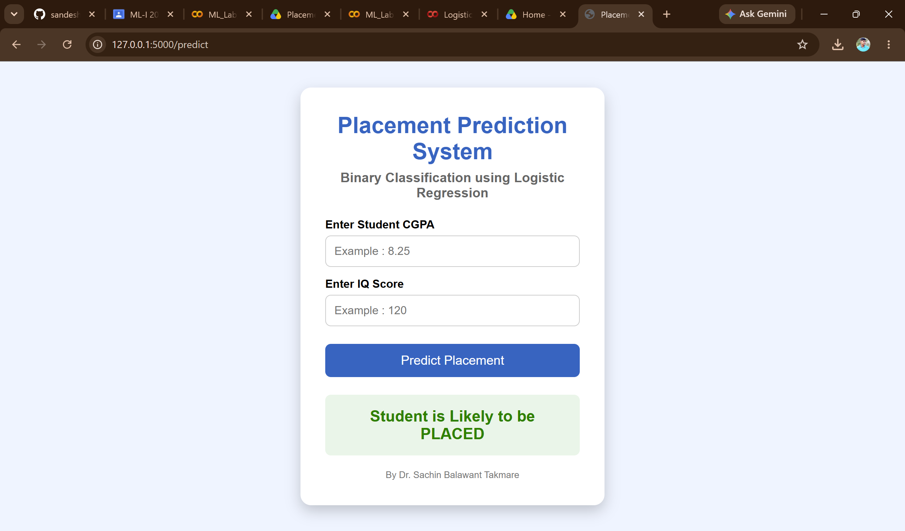
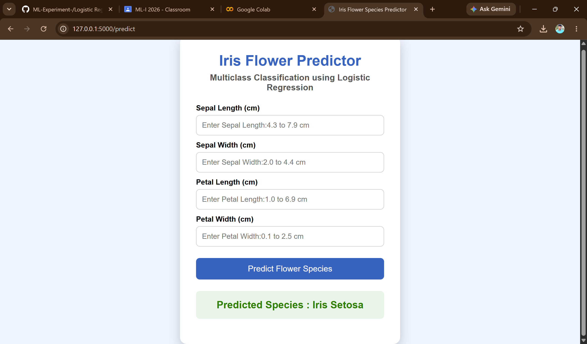

 # 1.Python-Libraries

Complete Python Library Google Colab Notebooks.

---

## 📖 Libraries Included

-  NumPy
-  Pandas
-  Matplotlib
-  Seaborn
-  Scikit-learn
-  PyTorch
-  TensorFlow
-  Keras

---
## Open in Google Colab

Simply open any notebook and click *Open in Colab* to run it online.

---

<br>

 # Dataset
 ---
A lightweight dataset repository for analyzing machine learning model parameters, tracking core validation metrics, and testing experimental optimization loops.

## Core Features

* **Balanced Framework:** Structured specifically to study training loss landscapes.
* **Pre-processed Input:** Fully cleaned vectors designed for easy feature extraction.
* **Minimal Noise:** Reduced dimensional collinearity for fast experimentation.

## Technical Requirements

The dataset operations rely on standard data science libraries:

```text
pandas>=1.3.0
numpy>=1.21.0
scikit-learn>=1.0.0
```

## Quick Start & Usage

### 1. Installation
Clone the repository path directly into your workspace terminal:

```bash
git clone https://github.com
cd ML-Experiment-
```

### 2. Implementation
Import the localized feature files into your active script setup:

```python
import pandas as pd

# Load the experiment dataset array
data = pd.read_csv("data/experiment_data.csv")

# Extract the base target matrix
X = data.drop(columns=["target"])
y = data["target"]

print(f"Dataset arrays loaded successfully with shape: {X.shape}")
```

<br>

# 2.Simple Linear Regression

A simple **Linear Regression** model built using Python and machine learning libraries.

## 📌 Features

* Loads and processes data
* Trains a Linear Regression model
* Makes predictions
* Displays model output/visualization

## 🛠️ Technologies

* Python
* NumPy
* Pandas
* Matplotlib
* Scikit-learn

## ▶️ How to Run

```bash
pip install numpy pandas matplotlib scikit-learn
python linear_regression.py
```

## 📊 Output

The model generates a prediction/visualization like the image below:

.png)


<br>


# 3.Multiple Linear Regression

This experiment demonstrates Multiple Linear Regression, a supervised machine learning algorithm used to predict a dependent variable using two or more independent variables.

## Objective

To build a Multiple Linear Regression model and predict the target value based on multiple input features.

Technologies Used
* Python
* NumPy
* Pandas
* Matplotlib
* Scikit-learn

## Steps
* Load the dataset.
* Perform data preprocessing.
* Split data into training and testing sets.
* Train the Multiple Linear Regression model.
* Make predictions.
* Evaluate the model performance.

## Output
The model predicts the target value based on the given input features.


# 4.Logistic Regression For Binary Classification

This project uses **Logistic Regression** for binary classification to predict whether a student will be placed or not.

## Dataset

* `CGPA` – Number of hours studied
* `IQ` – Previous year marks
* `Placement` – Target variable (0 = Not Placed, 1 = Placed)

## Output

The model predicts whether a student will be **Placed (1)** or **Not Placed (0)** based on CGPA and IQ.



<br>


# 5.Logistic Regression – Multiclass Classification

## About

This project uses **Logistic Regression** for **multiclass classification**. The model predicts which class a given input belongs to using Python and Scikit-learn.

## Technologies Used

* Python
* Pandas
* NumPy
* Scikit-learn
* Matplotlib

## Workflow

1. Load the dataset
2. Preprocess the data
3. Split the data into training and testing sets
4. Train the Logistic Regression model
5. Make predictions
6. Evaluate the model

## Output



The output shows the predictions and performance of the multiclass classification model.

## Author

Sandesh Mohite

